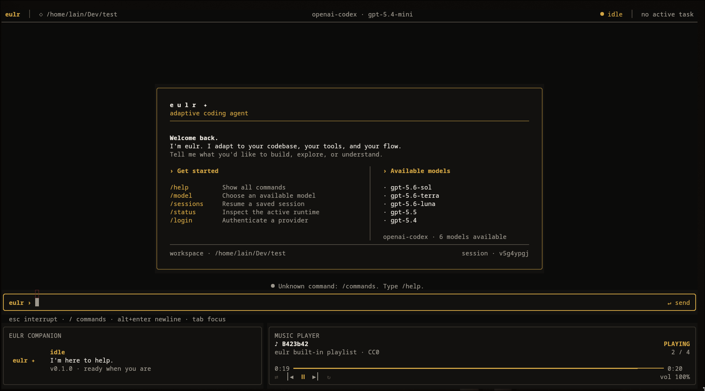

# eulr

`eulr` is a small, terminal-first local coding agent with a retained,
full-screen interactive interface. It keeps its own agent
loop, message history, provider adapters, authentication, tools, permission
decisions, context management, and persisted sessions. It does not run Codex
CLI or another coding agent and does not read their credentials.

```text
User instruction -> agent loop -> model -> local tool -> model -> final answer
```

<p align="center">
  
</p>

## Requirements

- Node.js 22 or newer
- pnpm
- A ChatGPT Plus/Pro account with Codex access, or an API key accepted by an
  OpenAI-compatible endpoint

## Install

### Via NPM
```bash
npm i @lainx86/eulr
```

### or build locally by cloning this repo and:
```bash
pnpm install
pnpm build
pnpm add -g .
eulr --help
```

For local development, `pnpm dev -- --help` runs the TypeScript entry point
without a build.

## Authentication

Run:

```bash
eulr auth login
```

The prompt offers two independent methods:

1. **ChatGPT Plus/Pro** uses the current Codex OAuth authorization-code flow
   with PKCE. eulr starts a callback server bound to `127.0.0.1`, opens the
   authorization page, validates `state`, exchanges the code, and stores its
   own tokens. If the browser cannot be opened, the URL is printed.
2. **OpenAI-compatible API** reads an API key through hidden terminal input and
   stores it without putting it in shell history or process arguments.

For a headless ChatGPT login, when enabled for the account or workspace:

```bash
eulr auth login --device
```

The command displays the OpenAI verification URL and user code, then polls at
the server-provided interval. Browser login remains the default.

Check or remove eulr credentials with:

```bash
eulr auth status
eulr auth logout
```

ChatGPT subscription access and API billing are distinct. `openai-codex` sends
requests through the authenticated ChatGPT Codex service. `openai-compatible`
uses an API key and the configured API endpoint. eulr never switches between
these methods after a request fails.

## Running tasks

Start an interactive conversation in the current repository:

```bash
eulr
```

Start with a task already running:

```bash
eulr "find the failing test and fix it"
```

When stdin and stdout are TTYs, both forms open the full-screen TUI. The TUI
uses the alternate screen, incrementally redraws stable regions, and remains
ready for another instruction after a task finishes. In a pipe, redirect, or
CI environment, eulr automatically uses the plain renderer and a one-shot task
exits after its final response.

Force either mode explicitly:

```bash
eulr --tui
eulr --plain "explain this repository"
eulr --plain "explain this repository" > /tmp/eulr-output.txt
```

`--tui` fails with an actionable error if stdin/stdout are not interactive or
`TERM=dumb`. The supported baseline is a Unicode terminal with at least 256
colors. Truecolor terminals receive the richer warm charcoal/amber theme.

Common options:

```text
--cwd <path>           working-directory boundary
--provider <id>        openai-codex or openai-compatible
--model <id>           model for this invocation
--resume <session-id>  resume persisted conversation and tool history
--yes                  approve normal writes and commands for this session
--plain                force stable append-only output
--tui                  require the full-screen interactive UI
--debug                write sanitized technical diagnostics
```

CLI values override configuration and environment values. Provider selection
uses the CLI value first, then the saved default, then `EULR_PROVIDER`, then the
only provider with a usable credential. A request failure never triggers a
provider fallback.

List available models or recent sessions with:

```bash
eulr models
eulr sessions
```

The ChatGPT provider obtains the model catalog from the authenticated account.
The compatible provider uses its endpoint's model catalog when available and
the explicitly configured model otherwise. Defaults are stored per provider.

## Full-screen TUI

The screen always keeps this vertical order:

```text
dynamic main area
input area
companion | music player
```

The idle main area shows a dense welcome card with real quick actions, workspace
and session details, and the active provider's asynchronously refreshed model
catalog. A catalog failure keeps the configured model visible and does not
block input.
While the welcome screen is idle, `/status` replaces the quick-action column
with a retained runtime status view. It shows the active model and reasoning
level, provider and authentication method, workspace approval mode, account
identity when available, session state, cumulative token usage, and an
estimated conversation-context bar against the model catalog's context window.
Provider rate-limit periods are not shown because eulr does not currently
receive authoritative reset data for them.
During a task it becomes an activity timeline and context inspector with
`Changes`, `File`, `Output`, and `Answer` tabs. Read results open File,
write/edit metadata produces an in-memory diff (including new files and
repositories without commits), command streams open Output, and final text
opens Answer. Activity and inspector scrolling never moves the input or dock.
Scrolling is scoped to those two panels only; the input, companion, and music
player remain fixed regardless of viewport length or focus changes.

Tabs, carriage returns, and other terminal-positioning controls from source or
command output are normalized before rendering. React and dependency console
diagnostics are redirected to the redacted TUI log instead of being written
over the retained screen.

The layout switches between full, compact, and minimum modes on resize. In
minimum mode one main panel is visible at a time, while input, companion, and
music remain pinned. Very small terminals degrade to terse content without
changing region order.

Main key bindings:

```text
Tab / Shift+Tab       move focus
PageUp / PageDown     scroll focused panel
Home / End            start/end of focused viewport
Left / Right          change inspector tab; seek when music is focused
Shift+Left / Right    scroll inspector content horizontally
Enter                 submit input
Alt+Enter             insert a newline
Escape                close overlay, return focus, or interrupt a task
Ctrl+C                interrupt active work; exit when idle
Ctrl+L                force a visual redraw
?                     help when input is empty
```

Typing `/` opens a left-aligned command palette directly above the input.
Continue typing to filter commands, use `Up`/`Down` to select, and press `Tab`
or `Enter` to complete a prefix. Pressing `Enter` on a fully typed command keeps
the existing behavior and runs that command; `Escape` closes the palette.

Pasted input uses bracketed-paste handling. Input supports cursor movement,
selection, multiline editing, and history. One message entered while the agent
is busy is shown as queued and submitted at the next model-safe run boundary.
The keyboard helper is rendered below the bordered input field so it does not
compete with the editable text.

Permission requests replace only the input contents. Press `Y` to allow once,
`A` to allow the category for the active session, or `N`/Escape to deny. The
activity history and bottom dock remain visible throughout.

## Interactive commands

```text
/help                 list commands
/login                authenticate and start a session for that provider
/logout               remove the active provider credential
/model                show available models and the active model
/model <model-id>     select a model, then choose its reasoning level
/new                  start a new session
/resume [session-id]  resume a saved session or open the selector
/sessions             open the recent-session selector
/music <command>      control remote or local music playback
/compact              summarize older context now
/status               open rich idle status; show a concise status while working
/clear                clear the terminal without deleting history
/exit                 flush the session and exit
```

Model and session lists open selectable TUI overlays. Selecting an OpenAI Codex
model opens a second, catalog-driven reasoning picker. It shows only the levels
advertised for that model (for example low, medium, high, xhigh, and, where
available, max or ultra), marks the provider default, and persists the model and
effort together. Codex Ultra is a client preset whose inference request uses Max
effort, matching the pinned official Codex implementation. Authentication
temporarily suspends the alternate screen so browser/API-key prompts can safely
own the terminal, then redraws the TUI.

`Ctrl+C` cancels the active provider stream or command, stops its process group,
marks the run cancelled, flushes the session, and restores the retained input.
On exit, SIGTERM, or a fatal render error, raw mode, cursor visibility,
bracketed paste, and the original screen buffer are restored.

## Companion and music

The left dock panel maps actual agent state to idle, thinking, reading, editing,
running, permission, completed, error, and cancelled states. No raster artwork
ships in this repository, so the renderer uses the neutral `eulr ✦` mark.
Optional future assets have stable slots under `assets/companion/`; because Ink
does not expose a stable cross-terminal image primitive, unsupported or missing
image protocols always use the Unicode fallback. See
[`docs/tui-architecture.md`](docs/tui-architecture.md).

The right dock panel is a functional player backed by `mpv` JSON IPC. Remote
radio is the default source. eulr requests the station catalog and live
now-playing state from `https://eulr-music-service.vercel.app`, gives the
returned audio URL directly to mpv, and seeks to the station position instead
of downloading the file into Node.js memory. Periodic refresh and end-of-track
refresh detect station changes; position corrections occur only when drift is
large enough to matter.

eulr starts mpv lazily in audio-only mode, uses a private temporary IPC socket,
tracks playback state, and closes the process on exit. Install `mpv` separately;
eulr never downloads it. If mpv or the radio service is unavailable, the panel
reports an offline status, retries the service with bounded exponential backoff,
and leaves the coding agent fully usable. No audio files are bundled in the npm
package.

```text
/music remote          select the synchronized eulr radio (default)
/music local           select the configured local library
/music off             disable music without affecting the agent
/music library <path>  scan and select a local library
/music play            start playback
/music pause           pause playback
/music toggle          toggle play/pause
/music next            next track
/music previous        previous track
/music seek <seconds>  seek to an absolute position
/music volume <0-100>  set volume
/music shuffle         toggle shuffle
/music repeat          toggle repeat
/music status          show player status
```

Supported files include MP3, FLAC, M4A, AAC, Ogg/Opus, WAV, AIFF, ALAC, WebM,
and WMA when the installed mpv can decode them. Music focus adds Space,
Left/Right, Up/Down, `N`, `P`, `S`, and `R` for playback, seek, volume, track,
shuffle, and repeat controls. Source, local-library path, remote service URL,
volume, modes, last local track, and local position are stored in eulr config
independently of coding sessions. A legacy config that only has `libraryPath`
continues in local mode; otherwise new installations use remote mode.

## Tools and permissions

The model can invoke four locally implemented tools:

- `read`: numbered text-file reads with line ranges and bounded output
- `write`: atomic file creation or replacement
- `edit`: exact-text replacement, with explicit handling of ambiguous matches
- `bash`: shell commands run with `spawn`, timeout, cancellation, and bounded
  stdout/stderr capture

All file targets are resolved against `--cwd`. Existing paths use their real
path. New targets validate the nearest existing real parent. Traversal,
absolute paths outside the workspace, and symbolic-link escapes are rejected.

Ordinary reads run automatically. Writes and commands require confirmation;
`a` approves that category for the active session. `--yes` approves normal
writes and commands, but never bypasses explicit confirmation for high-risk
commands such as destructive Git cleanup, force pushes, disk overwrite,
filesystem formatting, shutdown, or mass deletion. Common shell forms that read
`.env*`, private keys, or credential files are also treated as high risk.
Direct file reads of those paths require a separate sensitive-read approval,
including when a harmless-looking symlink points to one.

## Sessions and context

Sessions are append-only JSONL files under `~/.eulr/sessions/`. Events include
messages, tool execution, model and reasoning selection, usage, compaction, and
status. Resume validates every complete event, tolerates a partial crash tail,
reconstructs state, and does not re-run old tool calls.

The context manager preserves the system prompt, root `AGENTS.md` instruction,
summary, recent turns, and complete tool-call/result pairs. It reloads a changed
root `AGENTS.md` before a model turn. When context crosses its threshold, eulr
asks the active model for a structured factual summary and retains recent turns
unchanged. `/compact` runs this process explicitly.

## Configuration

Files owned by eulr:

```text
~/.eulr/auth.json       provider credentials, mode 0600 on POSIX
~/.eulr/config.json     default provider, models, and base URLs
~/.eulr/sessions/*.jsonl
~/.eulr/logs/eulr.log   redacted TUI diagnostics
```

The `~/.eulr` directory is created with user-only permissions on POSIX.
Credential writes are atomic and lock files prevent concurrent eulr processes
from overwriting credential updates or rotating the same refresh token at once.
Tokens, authorization headers, and recognized credential fields are redacted
from errors, debug logs, permission prompts, and tool-derived terminal output.
Approved sensitive tool content can still enter model context, so grant those
prompts deliberately. eulr does not read `~/.codex`, `~/.config/opencode`,
`~/.pi`, or any other agent's credential area.

Supported environment variables:

```text
EULR_PROVIDER   provider ID
EULR_MODEL      model ID
EULR_API_KEY    API key for openai-compatible
EULR_BASE_URL   compatible API base URL
EULR_MUSIC_SERVICE_URL override the remote radio service base URL
EULR_HOME       override eulr's data directory
EULR_NO_BROWSER disable automatic browser opening when set to 1
NO_COLOR        disable colors in plain output (TUI backgrounds remain painted)
```

Full-screen mode paints every terminal cell with an explicit 256-color or
truecolor background, including when `NO_COLOR` is set, so transparent default
terminal cells do not show through individual regions. A terminal compositor
that applies opacity to the entire window can only be changed in that terminal's
configuration.

Example configuration:

```json
{
  "defaultProvider": "openai-compatible",
  "providers": {
    "openai-codex": { "defaultModel": "<account-model>" },
    "openai-compatible": {
      "defaultModel": "<model-id>",
      "baseUrl": "https://api.openai.com/v1"
    }
  },
  "music": {
    "source": "remote",
    "serviceUrl": "https://eulr-music-service.vercel.app",
    "volume": 70
  }
}
```

The remote service URL is selected in this order:
`EULR_MUSIC_SERVICE_URL`, `music.serviceUrl` in config, then the public default
above. Valid music sources are `remote`, `local`, and `off`.

## Architecture

The runtime is split into provider-independent layers:

```text
CLI -> plain renderer | typed TUI bridge -> retained TUI store
              `-> Agent -> ModelProvider
          |-> ToolRegistry -> PermissionManager -> local filesystem/processes
          |-> ContextManager
          `-> SessionService -> JSONL event store

Authentication -> eulr credential store
Providers      -> OpenAI Codex SSE | OpenAI SDK compatible streaming
Music          -> RemoteMusicClient | local scanner -> MusicService -> mpv IPC
```

`src/providers/provider.ts` defines normalized requests and streamed events.
`src/agent/loop.ts` owns the model/tool loop. `src/tui/event-bridge.ts` maps
provider-independent lifecycle/tool events into retained visual state.
`src/tools` and `src/permissions`
enforce local execution policy. `src/sessions` owns persistence and recovery.
Provider SDK and transport objects do not enter agent messages or session data.

The ChatGPT integration uses the protocol currently implemented by official
OpenAI Codex, including its OAuth client and HTTP SSE fallback transport. This
protocol can change and is intentionally isolated in `src/auth` and
`src/providers/openai-codex.ts`. See the pinned sources and implementation
choices in [`docs/codex-protocol.md`](docs/codex-protocol.md).

## Development

```bash
pnpm install
pnpm format
pnpm lint
pnpm typecheck
pnpm test
pnpm build
```

Tests use mock HTTP servers, scripted providers, fake terminals, and mock music
backends. They never require a real
OAuth login or model request. Coverage includes agent-loop behavior, auth and
refresh, tools, permission/security boundaries, JSONL recovery, compaction, and
an integration flow that reads, edits, tests, and completes a fixture task.

## Version 1 limits

- No MCP, sub-agents, or repository embeddings
- The TUI uses a Unicode companion mark until project artwork and a stable Ink
  terminal-image adapter are available
- Music playback requires a separately installed `mpv`; remote radio also
  depends on the separately operated eulr music service, and cover-art
  rendering is not available in the baseline dock
- Commands run through the system shell and are approved as a single command
- High-risk analysis covers common structured command forms but is not an OS
  sandbox; dynamically generated scripts can obscure their eventual behavior
- Tool calls from one model response execute sequentially
- The compatible provider targets broadly supported Chat Completions streaming
- The ChatGPT provider deliberately uses the official client's HTTP SSE
  fallback rather than its preferred WebSocket transport
- Live login, model availability, and inference depend on the user's account,
  workspace policy, and current OpenAI service behavior

See [CONTRIBUTING.md](CONTRIBUTING.md) for the repository workflow and
[LICENSE](LICENSE) for the MIT license.
