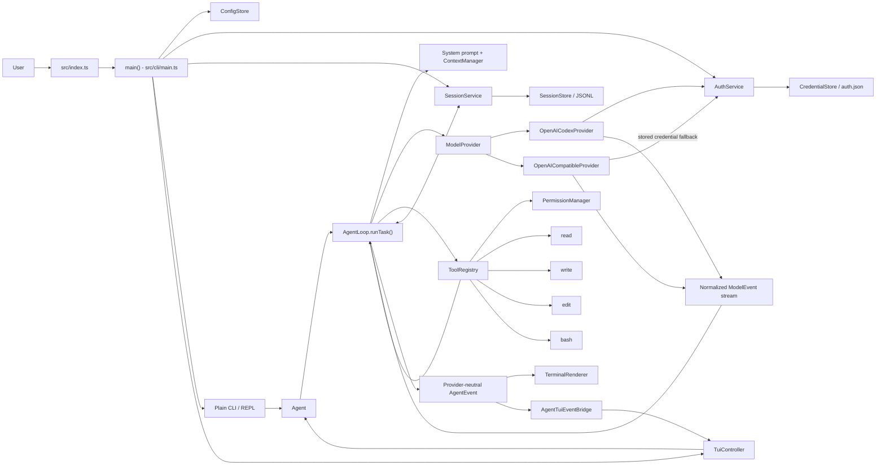
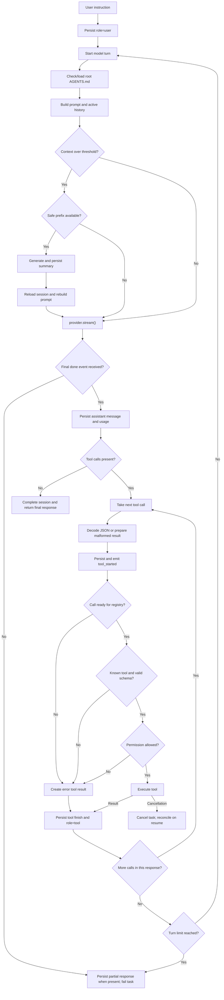

# Arsitektur eulr

Dokumen ini menjelaskan arsitektur runtime `eulr` berdasarkan execution path yang
digunakan oleh source code saat ini. Fokusnya adalah perjalanan sebuah instruksi
pengguna dari CLI atau TUI, melalui agent loop dan model provider, sampai tool
dijalankan dan respons akhir ditampilkan.

## 1. Gambaran umum

`eulr` membagi runtime ke beberapa boundary utama:

- CLI dan TUI menerima input serta merender event agent.
- `Agent` menjadi facade untuk menjalankan task pada sebuah session.
- `AgentLoop` mengatur percakapan multi-turn antara model dan tool.
- `ModelProvider` menormalkan perbedaan protocol model.
- `ToolRegistry` menyediakan definisi, validasi, permission, dan eksekusi tool.
- `ContextManager` memilih history aktif dan memicu compaction.
- `SessionService` menyimpan seluruh perubahan state sebagai event JSONL.

Pusat alurnya adalah `AgentLoop.runTask()` di `src/agent/loop.ts`. Setiap task
dimulai dengan user message, dilanjutkan oleh satu atau lebih model turn, dan
berakhir ketika model memberikan respons tanpa tool call. Jika model meminta tool,
hasil eksekusinya dimasukkan kembali ke history sebelum model dipanggil lagi.

Agent core menggunakan tipe internal dari `src/providers/provider.ts` dan
`src/agent/messages.ts`. Detail request, response, streaming event, dan credential
provider ditangani di luar core oleh implementasi provider, adapter wire protocol,
dan `AuthService`.

## 2. Komponen utama

| Komponen               | Implementasi                                                      | Tanggung jawab                                                                     |
| ---------------------- | ----------------------------------------------------------------- | ---------------------------------------------------------------------------------- |
| Entry point            | `src/index.ts`, `src/cli/main.ts`                                 | Memproses argument, membuat service, memilih mode terminal, dan merakit runtime    |
| Input plain            | `src/cli/args.ts`, `src/cli/interactive.ts`                       | One-shot task, interactive prompt, slash command, dan cancellation                 |
| Input TUI              | `src/tui/app.tsx`, `src/tui/tui-controller.ts`                    | Input retained TUI, task submission, command handling, dan queued follow-up        |
| UI event bridge        | `src/tui/event-bridge.ts`, `src/tui/runtime-bindings.ts`          | Mengubah event agent menjadi state TUI dan meneruskan permission response          |
| Agent facade           | `src/agent/agent.ts`                                              | Menjalankan task, melakukan compaction, dan menjaga cached session state           |
| Agent loop             | `src/agent/loop.ts`                                               | Model turn, stream collection, tool round-trip, persistence, dan lifecycle task    |
| Prompt dan instruction | `src/agent/system-prompt.ts`, `src/agent/project-instructions.ts` | System prompt, workspace context, root `AGENTS.md`, dan compacted summary          |
| Context                | `src/agent/context-manager.ts`, `src/agent/compaction.ts`         | Active history, estimasi context, safe compaction boundary, dan summary generation |
| Provider               | `src/providers/provider.ts`, `src/providers/registry.ts`          | Kontrak provider-neutral dan pemilihan implementasi provider                       |
| Tools                  | `src/tools/tool.ts`, `src/tools/registry.ts`                      | Kontrak tool, JSON Schema, Zod validation, permission, dan eksekusi                |
| Permission             | `src/permissions/permission-manager.ts`                           | Keputusan read, write, execute, sensitive-read, dan high-risk-execute              |
| Session                | `src/sessions/session-service.ts`, `src/sessions/store.ts`        | Append event, reconstruction, resume, usage, compaction, dan status session        |
| Auth dan config        | `src/auth/`, `src/config/`                                        | Credential, token refresh, provider/model default, dan data paths                  |

## 3. Entry point dan inisialisasi runtime

Executable dimulai dari `src/index.ts`. File ini memanggil `main()` dari
`src/cli/main.ts` dan memakai nilai kembalian tersebut sebagai process exit code.

`main()` melakukan inisialisasi dalam urutan berikut:

1. `parseArgs()` di `src/cli/args.ts` mengubah command-line arguments menjadi
   command dan options internal.
2. `getEulrPaths()` di `src/config/data-paths.ts` menentukan lokasi config,
   credential, dan session.
3. `ConfigStore`, `CredentialStore`, `AuthService`, `SessionStore`, dan
   `SessionService` dibuat untuk command aktif.
4. Command top-level seperti auth, model listing, dan session listing diproses oleh
   branch command di `main()`.
5. Untuk task atau interactive mode, `createRuntime()` di `src/cli/main.ts` memuat
   config, memilih provider/model, membuat atau me-resume session, lalu merakit
   permission manager, tool registry, context manager, agent loop, dan agent facade.

Provider dipilih oleh logic di `createRuntime()` bersama `selectProvider()` dari
`src/config/config-store.ts`. Saat session di-resume, provider dan working directory
dari session digunakan kembali. Untuk session baru, selection mempertimbangkan CLI,
config, environment, dan readiness credential lokal.

Model dipilih dari request CLI, resumed session, default model provider di config,
atau `EULR_MODEL`. `resolveModel()` di `src/cli/main.ts` mengambil metadata model
yang diperlukan untuk menentukan context window dan reasoning options.

Setelah provider dan model tersedia, `createRuntime()` membuat:

- `PermissionManager` dari `src/permissions/permission-manager.ts`;
- empat tool default melalui `createDefaultToolRegistry()`;
- `ContextManager` dengan catalog context window bila tersedia atau default 100.000
  token;
- `AgentLoop` dengan provider, model, session service, tools, permissions, context,
  dan event callback;
- `Agent` dengan session state awal.

## 4. Jalur input pengguna

Ada tiga jalur task yang semuanya bertemu di `Agent.run()` dari
`src/agent/agent.ts`:

### One-shot

Untuk pemanggilan seperti `eulr "periksa test"`, `main()` memilih jalur sesuai mode
terminal. Jika TUI aktif, task diteruskan sebagai `initialTask` ke `runTui()` dan
dijalankan melalui `TuiController`. Pada plain mode, branch one-shot di
`src/cli/main.ts` memanggil `runtime.agent.run(task, { signal })` secara langsung dan
menampilkan stream melalui `TerminalRenderer` di `src/cli/renderer.ts`.

### Plain interactive

`runInteractive()` di `src/cli/interactive.ts` membaca input menggunakan readline.
Input yang diawali `/` diteruskan ke interactive command handler. Input lainnya
menjadi instruksi baru untuk `Agent.run()` pada session aktif.

### TUI

`TuiApp` di `src/tui/app.tsx` meneruskan submit ke `TuiController.submit()` di
`src/tui/tui-controller.ts`. Controller membedakan slash command dan task biasa,
lalu menjalankan task melalui `TuiController.executeRun()`. Ketika sebuah run masih
aktif, controller dapat menyimpan satu follow-up dan menjalankannya setelah run
tersebut selesai.

Ketiga jalur memakai `CancellationCoordinator` dari `src/cli/interactive.ts` untuk
membuat `AbortSignal` bagi operasi yang sedang aktif.

## 5. Alur agent dari input sampai respons

`Agent.run()` mendelegasikan pekerjaan ke `AgentLoop.runTask()` dan memperbarui
cached session state dari hasil loop. Alur satu task adalah:

1. Loop memeriksa cancellation dan memastikan provider runtime sama dengan provider
   session.
2. Session diubah ke status `active` bila diperlukan.
3. Instruksi disimpan sebagai `AgentMessage` dengan role `user` melalui
   `SessionService.addMessage()`.
4. Pada awal setiap model turn, loop memeriksa root `AGENTS.md`, menyusun system
   prompt, dan mengambil message yang masih aktif dari `ContextManager`.
5. Bila ukuran context melewati threshold dan ada safe message boundary,
   `compactContext()` membuat summary sebelum request utama diteruskan.
6. `collectResponse()` memanggil `ModelProvider.stream()` dan mengonsumsi normalized
   `ModelEvent` satu per satu.
7. Text delta langsung di-emit ke renderer. Reasoning, provider item, tool-call
   fragment, usage, dan final marker dikumpulkan di dalam `CollectedResponse`.
8. Text, reasoning, provider item, dan tool call disimpan sebagai assistant message.
   Usage disimpan sebagai `usage_updated` event, sedangkan final marker dipakai untuk
   memastikan stream selesai.
9. Jika respons tidak berisi tool call, session ditandai `completed`,
   `task_completed` di-emit, dan text dari model turn terakhir dikembalikan sebagai
   final response.
10. Jika respons berisi tool call, setiap call dijalankan secara berurutan melalui
    `executeToolCall()`.
11. Tool result disimpan sebagai role `tool`, session di-reload, lalu loop memulai
    model turn berikutnya dengan history yang sudah memuat hasil tersebut.

Runtime memakai batas default 50 model turn per task. Batas ini ditetapkan oleh
`DEFAULT_MAX_TURNS` dan constructor `AgentLoop` di `src/agent/loop.ts`.

## 6. Reasoning dan pemilihan tindakan

Reasoning dan pemilihan tindakan berlangsung pada model provider. Agent core
menyiapkan informasi yang diperlukan model melalui `collectResponse()`:

- system prompt;
- active message history;
- daftar tool beserta JSON Schema input;
- model aktif;
- reasoning effort untuk provider Codex;
- session ID.

Adapter Responses di `src/providers/adapters/responses.ts` dan request Chat
Completions di `src/providers/openai-compatible.ts` memakai tool choice otomatis.
Model kemudian menghasilkan salah satu atau kombinasi dari text, reasoning event,
dan tool call. `AgentLoop` tidak menentukan isi tindakan secara semantik; tanggung
jawabnya adalah memvalidasi protocol event, menjalankan tool yang disebut model, dan
mengembalikan hasilnya ke model.

Untuk `openai-codex`, reasoning effort dipilih melalui logic di `src/cli/main.ts`
dan mapping `src/providers/reasoning.ts`. Adapter Responses mengirim effort tersebut
bersama `summary: "auto"`.

`reasoning_delta` dikumpulkan dan disimpan sebagai assistant content bertipe
`reasoning`, tetapi renderer menerima status `thinking` alih-alih reasoning text
verbatim. Codex juga dapat mengirim encrypted reasoning item. Item ini disimpan
sebagai `provider_item` yang JSON-safe dan dimasukkan kembali oleh
`toResponsesInput()` pada request Codex berikutnya.

## 7. Message dan system prompt

Message internal didefinisikan di `src/agent/messages.ts`:

- role `user` menyimpan instruksi pengguna;
- role `assistant` menyimpan text, reasoning, provider item, dan tool call;
- role `tool` menyimpan call ID, nama tool, content, dan status error.

Semua bentuk message merupakan object serializable. Agent core tidak menyimpan SDK
object di dalam session.

`createSystemPrompt()` di `src/agent/system-prompt.ts` menyusun prompt dari:

1. `BASE_SYSTEM_PROMPT` milik eulr;
2. canonical working directory session;
3. project instruction dari root `AGENTS.md` bila ada;
4. context summary hasil compaction bila ada.

`ProjectInstructionLoader` di `src/agent/project-instructions.ts` memeriksa
`<cwd>/AGENTS.md` pada setiap model turn. Loader membandingkan device, inode, size,
dan modification time dengan cache. Content dibaca ulang ketika signature berubah,
dibatasi sampai 32 KiB, dan canonical path-nya harus berada di dalam workspace.

## 8. Context management dan compaction

`ContextManager` di `src/agent/context-manager.ts` menentukan message yang dikirim
ke provider. `messagesForRequest()` mengambil history mulai dari
`compactedMessageCount`, sehingga message yang sudah dirangkum tidak dikirim ulang
sebagai raw history.

Ukuran context dihitung dari nilai terbesar antara:

- estimasi lokal berdasarkan jumlah karakter message dan system prompt; dan
- input token usage dari model turn sebelumnya dalam task yang sama.

Default context window adalah 100.000 token dengan threshold compaction 80 persen
dan delapan recent messages yang dipertahankan. Saat catalog model menyediakan
context window, `createRuntime()` menggunakan nilai model tersebut.

`selectForCompaction()` memilih prefix history pada boundary user message dan
memastikan pasangan tool call/tool result di dalam prefix tetap konsisten.
`compactContext()` di `src/agent/compaction.ts` lalu membuat request khusus ke
provider yang sama dengan:

- compaction system prompt;
- previous summary bila ada;
- selected history dalam bentuk JSON;
- daftar tool kosong.

Summary yang berhasil disimpan sebagai `context_compacted` event bersama jumlah
message yang telah dirangkum. Raw event lama tetap berada di JSONL; summary dan
`compactedMessageCount` mengatur bentuk context pada request berikutnya. Command
`/compact` memanggil jalur yang sama melalui `Agent.compact()`.

## 9. Provider dan model request

Boundary provider berada di `src/providers/provider.ts`. `ModelProvider` menyediakan
dua operasi:

- `listModels()` untuk catalog model;
- `stream()` untuk menghasilkan `AsyncIterable<ModelEvent>`.

`AgentLoop.collectResponse()` membuat `ModelRequest` yang berisi model, reasoning
effort, system prompt, active messages, tool definitions, dan session ID. Provider
adapter mengubah request ini ke format wire provider, kemudian menormalkan response
menjadi event internal seperti `text_delta`, `reasoning_delta`, `tool_call_start`,
`tool_call_delta`, `tool_call_end`, `usage`, dan `done`.

### OpenAI Codex

`OpenAICodexProvider` di `src/providers/openai-codex.ts` menggunakan native `fetch`
dan Codex Responses SSE. Request body dibuat oleh `buildResponsesRequest()` di
`src/providers/adapters/responses.ts`. Request menggunakan streaming, automatic tool
choice, parallel tool-call capability, encrypted reasoning inclusion, prompt cache
key berbasis session, dan `store: false`.

Sebelum request, provider mengambil ChatGPT credential melalui
`AuthService.getValidChatGPTCredential()` di `src/auth/auth-service.ts`. Credential
yang mendekati expiry di-refresh dan hasilnya disimpan kembali oleh
`CredentialStore` di `src/auth/credential-store.ts`. Request menyertakan account dan
session routing metadata yang diperlukan transport Codex.

SSE dinormalisasi oleh `src/providers/adapters/responses.ts`. Stream harus mencapai
completion event agar agent turn dianggap lengkap. Provider melakukan retry terbatas
untuk network error dan HTTP 5xx sebelum streaming dimulai, serta satu forced token
refresh setelah respons 401.

### OpenAI-compatible

`OpenAICompatibleProvider` di `src/providers/openai-compatible.ts` menggunakan
official OpenAI JavaScript SDK dengan Chat Completions streaming. History diubah
oleh `src/providers/adapters/chat-completions.ts`, sedangkan tool definitions
diteruskan sebagai function tools.

Pada production runtime, API key berasal dari `EULR_API_KEY` atau credential yang
disimpan melalui `AuthService`. Base URL dipilih oleh
`src/config/config-store.ts` dengan urutan config, `EULR_BASE_URL`, lalu base URL dari
stored API credential. Streaming text, tool argument delta, usage, dan finish event
dinormalisasi menjadi `ModelEvent` yang sama dengan provider Codex.

## 10. Tool registry dan eksekusi

Kontrak tool berada di `src/tools/tool.ts`. Setiap tool mempunyai:

- nama dan deskripsi;
- Zod input schema;
- permission dasar;
- `execute(input, context)` yang menghasilkan `ToolResult`.

`createDefaultToolRegistry()` di `src/tools/registry.ts` mendaftarkan empat tool:

- `read` dari `src/tools/read.ts` membaca file teks dengan line range, line numbers,
  binary detection, dan output limit;
- `write` dari `src/tools/write.ts` membuat parent directory dan menulis seluruh
  file secara atomic;
- `edit` dari `src/tools/edit.ts` melakukan exact-text replacement dan menulis hasil
  secara atomic;
- `bash` dari `src/tools/bash.ts` menjalankan system shell dengan `spawn`, stream
  stdout/stderr, timeout, cancellation, dan bounded retained stdout/stderr dengan
  head/tail preservation.

`ToolRegistry.definitions()` mengubah Zod schema menjadi JSON Schema yang dikirim ke
model. Saat model menghasilkan tool call, pipeline eksekusinya adalah:

1. `AgentLoop.executeToolCall()` memastikan call lengkap dan argument-nya merupakan
   JSON yang valid, atau menyiapkan error result untuk call yang tidak lengkap atau
   malformed.
2. Agent loop menyimpan dan memancarkan `tool_started` dengan parsed atau raw input.
3. Bila call siap dieksekusi, `ToolRegistry.execute()` mencari tool berdasarkan nama.
4. `inputSchema.safeParseAsync()` memvalidasi argument.
5. `preparePermission()` membuat permission request berdasarkan tool, path, dan
   command risk.
6. `PermissionManager.check()` meminta atau memberikan izin.
7. Tool dijalankan dengan parsed input, canonical cwd, `AbortSignal`, dan output
   callback.
8. Untuk result sukses atau ordinary error, execution finish dan role `tool` message
   disimpan ke session. Cancellation dipropagasi; pending call tersebut
   direkonsiliasi oleh `SessionService.resume()` ketika session dilanjutkan.

Malformed argument, unknown tool, validation error, permission denial, dan ordinary
tool execution error diubah menjadi error `ToolResult`. Hasil tersebut tetap masuk
ke conversation history sehingga model dapat menanggapinya pada turn selanjutnya.
Beberapa tool call dalam satu model response dijalankan secara sequential sesuai
urutan response.

## 11. Permission dan workspace

Permission categories didefinisikan di `src/permissions/types.ts`:

- `read`;
- `write`;
- `execute`;
- `sensitive-read`;
- `high-risk-execute`.

`PermissionManager.check()` di `src/permissions/permission-manager.ts` langsung
mengizinkan ordinary read. Write dan normal execute meminta konfirmasi, atau
diizinkan oleh flag `--yes`. Flag tersebut tidak meloloskan sensitive read atau
high-risk execute. Sensitive read meminta konfirmasi kecuali kategorinya sudah
diizinkan untuk runtime aktif. High-risk execute meminta keputusan baru untuk setiap
operasi dan tidak dimasukkan ke session approvals.

Sensitive path classification memakai `isSensitivePath()` dari
`src/permissions/permission-manager.ts`. Command classification memakai
`analyzeCommandRisk()` di `src/permissions/command-risk.ts`, yang mengenali struktur
command berisiko seperti recursive deletion pada root/home, disk formatting,
shutdown, destructive Git operations, sensitive readers, dan fork bomb.

File tools menggunakan `resolveWorkspacePath()` di `src/utils/paths.ts`. Resolver
mengubah workspace menjadi real path, memeriksa target yang sudah ada, mencari
nearest existing parent untuk target baru, dan memvalidasi symlink agar target tetap
di dalam workspace. `read`, `write`, dan `edit` menggunakan resolver yang sama.

`bash` memulai process dengan canonical workspace sebagai `cwd`. `BashTool` memakai
system shell, mewarisi process environment, dan mengalirkan stdout/stderr ke callback
agent. High-risk command classification dan execute permission diterapkan sebelum
process dibuat.

Plain permission prompt ditangani `PromptService.confirmPermission()` di
`src/cli/prompts.ts`. Dalam TUI, request diteruskan melalui `TuiPermissionBroker` di
`src/tui/event-bridge.ts`, sehingga prompt permission dapat ditampilkan di input
area tanpa menghentikan rendering panel agent.

## 12. Session dan persistence

Session events didefinisikan dan divalidasi dengan Zod di
`src/sessions/events.ts`. Event mencakup:

- session creation dan status;
- message addition;
- tool execution start dan finish;
- usage update;
- context compaction;
- model dan reasoning-effort change.

`SessionStore.append()` di `src/sessions/store.ts` memvalidasi event, menulis satu
baris JSON, melakukan `datasync`, dan memakai file mode user-only pada POSIX. Append
untuk satu session diserialisasi dalam instance store. Saat load,
`reconstructSession()` di `src/sessions/state.ts` melipat urutan event menjadi
`SessionState` berisi messages, tool executions, usage, summary, model, reasoning,
dan status.

`SessionService.resume()` di `src/sessions/session-service.ts` merekonsiliasi tool
call yang belum mempunyai role `tool` message. Bila finished execution sudah
tersimpan, content tersebut dipakai sebagai result. Existing unfinished execution
diberi interruption result. Tool lama tidak dieksekusi ulang selama reconstruction.

Agent loop menyimpan user message sebelum model request, assistant message sebelum
tool execution, lalu tool start/result setelah model memilih tindakan. Urutan ini
membuat conversation serta catatan dan status eksekusi tool dapat direkonstruksi
dari JSONL setelah process berhenti.

## 13. Error, retry, timeout, dan cancellation

Error internal berada di `src/utils/errors.ts`. `AgentLoop.runTask()` membedakan
cancellation dari failure, mengubah status session, mencoba flush store, dan
memancarkan lifecycle event yang sudah melalui redaction.

Provider error menghentikan model turn. Jika stream sudah menghasilkan assistant
content, catch path di `AgentLoop.runTask()` mengambil partial response dari error
dan menyimpannya melalui `persistAssistant()` sebelum status task diperbarui.

Retry berada pada implementasi provider:

- `OpenAICodexProvider` melakukan retry terbatas untuk network error dan HTTP 5xx
  sebelum stream, serta refresh credential sekali setelah 401;
- `OpenAICompatibleProvider` meneruskan konfigurasi `maxRetries` ke OpenAI SDK.

Tool error biasa dikembalikan sebagai tool result agar model dapat memprosesnya.
Cancellation dipropagasi sebagai `CancellationError` dan menghentikan task.

`CancellationCoordinator` membuat satu `AbortController` untuk active operation.
Signal diteruskan ke agent loop, provider stream, compaction request, permission
prompt, tool registry, dan `BashTool`. `Ctrl+C` atau `SIGTERM` menggunakan jalur ini
untuk membatalkan operasi aktif.

`BashTool` mempunyai timeout default 120 detik dan menerima nilai sampai 30 menit.
Saat timeout atau cancellation, process group dihentikan dengan SIGTERM lalu SIGKILL
setelah grace period pada POSIX. Timeout menjadi error tool result, sedangkan abort
menjadi cancellation task.

## 14. Hubungan CLI, TUI, agent, provider, dan tools

`AgentLoop` memancarkan event provider-neutral dari `src/agent/events.ts`. Event ini
memisahkan core dari cara terminal menampilkan aktivitas.

`TerminalRenderer` di `src/cli/renderer.ts` menangani plain output. Text delta
ditulis sebagai stream, reasoning ditampilkan sebagai status `Thinking`, dan tool
events ditampilkan sebagai activity lines.

Untuk TUI, `AgentTuiEventBridge` di `src/tui/event-bridge.ts` memetakan event yang
sama ke retained state di `src/tui/state/tui-store.ts`. Activity, file preview,
changes, command output, answer, usage, dan companion state diperbarui dari event
agent, bukan dengan membaca output renderer plain.

`TuiRuntimeBindings` di `src/tui/runtime-bindings.ts` menjadi boundary yang dipakai
saat `createRuntime()` dirakit sebelum store dan controller TUI tersedia. Setelah
`AgentTuiEventBridge` dan `TuiPermissionBroker` dibuat, bindings meneruskan agent
event dan permission request ke TUI.

Respons akhir tidak mempunyai jalur provider khusus. Provider mengirim normalized
text delta, agent loop menyimpan assistant message dan menandai session selesai,
lalu plain renderer atau TUI menampilkan text yang sama melalui `AgentEvent`.

## 15. Diagram arsitektur

## 16. Diagram alur satu task

