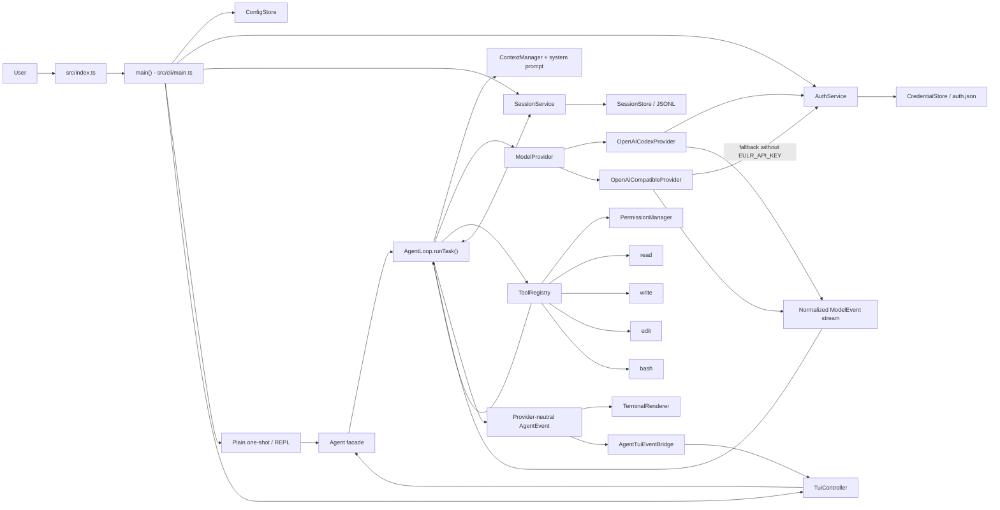
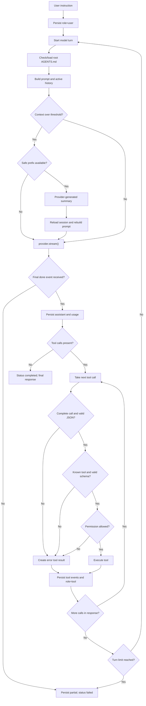

# Arsitektur Agent eulr

Dokumen ini menjelaskan execution path agent yang benar-benar dipakai oleh executable
`eulr` saat ini. Sumber kebenarannya adalah kode produksi di `src/`; nama file,
class, dan function dicantumkan agar setiap klaim utama dapat ditelusuri. Test,
README, nama file, dan komentar tidak dipakai sebagai bukti bila komponennya tidak
terhubung ke runtime.

## Status implementasi

Istilah berikut dipakai secara konsisten:

- **Implemented**: komponen terhubung ke execution path produksi dan mempunyai
  perilaku nyata yang dapat ditelusuri dari source.
- **Partially implemented**: komponen dipakai di produksi, tetapi cakupan atau
  jaminannya terbatas.
- **Not found**: tidak ditemukan implementasi yang digunakan oleh execution path
  produksi.

## 1. Gambaran umum

`eulr` adalah agent loop yang provider-neutral. CLI atau TUI menerima instruksi,
`Agent` meneruskannya ke `AgentLoop`, lalu loop menyusun context, meminta model
memilih antara respons teks dan tool call, menjalankan tool yang dipilih secara
berurutan, memasukkan hasil tool ke history, dan memanggil model lagi. Loop berhenti
ketika satu respons model selesai tanpa tool call, terjadi cancellation/error, atau
batas turn tercapai. Implementasi pusatnya adalah `AgentLoop.runTask()` di
`src/agent/loop.ts`; `Agent` di `src/agent/agent.ts` hanya facade yang menyimpan state
session terkini.

Agent core tidak mengimpor tipe wire dari OpenAI SDK atau Codex. Kontrak internal
`ModelProvider`, `ModelRequest`, dan `ModelEvent` berada di
`src/providers/provider.ts`. Adapter provider mengubah message dan event internal
ke/dari protocol masing-masing. Kontrak message serializable berada di
`src/agent/messages.ts`.

State percakapan tidak hanya berada di memory. `SessionService` dan `SessionStore`
di `src/sessions/session-service.ts` dan `src/sessions/store.ts` menulis event
append-only ke JSONL, kemudian `reconstructSession()` di `src/sessions/state.ts`
membangun ulang state saat load atau resume.

## 2. Komponen utama

| Lapisan          | Implementasi produksi                                                                                                     | Tanggung jawab aktual                                                               | Status                                                                 |
| ---------------- | ------------------------------------------------------------------------------------------------------------------------- | ----------------------------------------------------------------------------------- | ---------------------------------------------------------------------- |
| Entry point      | `src/index.ts`, `src/cli/main.ts`                                                                                         | Memproses command, membuat service, memilih plain/TUI, dan merakit runtime          | **Implemented**                                                        |
| Input plain      | `parseArgs()` di `src/cli/args.ts`, `runInteractive()` di `src/cli/interactive.ts`                                        | One-shot argument, REPL, slash command, dan signal cancellation                     | **Implemented**                                                        |
| Input TUI        | `TuiController` di `src/tui/tui-controller.ts`, `TuiApp` di `src/tui/app.tsx`                                             | Submit task/command, satu queued follow-up, focus dan rendering retained state      | **Implemented**                                                        |
| UI bridge        | `AgentTuiEventBridge`, `TuiPermissionBroker` di `src/tui/event-bridge.ts`                                                 | Memetakan `AgentEvent` provider-neutral ke store TUI dan permission prompt          | **Implemented**                                                        |
| Agent facade     | `Agent` di `src/agent/agent.ts`                                                                                           | Mendelegasikan run/compact dan menyegarkan cached session state                     | **Implemented**                                                        |
| Agent loop       | `AgentLoop` di `src/agent/loop.ts`                                                                                        | Multi-turn model/tool loop, stream collection, persistence, dan lifecycle status    | **Implemented**                                                        |
| Prompt           | `createSystemPrompt()` di `src/agent/system-prompt.ts`, `ProjectInstructionLoader` di `src/agent/project-instructions.ts` | Prompt internal, canonical cwd, root `AGENTS.md`, dan context summary               | **Implemented**                                                        |
| Context          | `ContextManager` di `src/agent/context-manager.ts`, `compactContext()` di `src/agent/compaction.ts`                       | Memilih active history, estimasi ukuran, dan model-generated compaction             | Compaction **Implemented**; token accounting **Partially implemented** |
| Provider         | `ProviderRegistry` dan dua provider di `src/providers/`                                                                   | Pemilihan provider statis, model catalog, request, streaming, dan normalisasi error | **Implemented**                                                        |
| Auth/config      | `AuthService`, `CredentialStore`, `ConfigStore` di `src/auth/` dan `src/config/`                                          | OAuth/API key, token refresh, credential/config persistence                         | **Implemented**                                                        |
| Tool system      | `ToolRegistry` di `src/tools/registry.ts` dan `read`, `write`, `edit`, `bash`                                             | Definition, Zod validation, permission request, execution, dan normalized result    | **Implemented**                                                        |
| Permission       | `PermissionManager` di `src/permissions/permission-manager.ts`                                                            | Auto-allow read, prompt protected operations, `--yes`, dan approval per runtime     | **Implemented**                                                        |
| Security helpers | `resolveWorkspacePath()` dan `analyzeCommandRisk()`                                                                       | Boundary file path serta klasifikasi command berisiko                               | **Partially implemented** sebagai security boundary keseluruhan        |
| Session          | `SessionService`, `SessionStore`, `reconstructSession()`                                                                  | Event JSONL, reconstruction, resume, usage, compaction, dan status                  | **Implemented**                                                        |

Music service di `src/music/` berjalan sebagai subsystem TUI yang independen. Ia
dibuat oleh `main()` dan diteruskan ke `runTui()` di `src/cli/main.ts`, tetapi tidak
ikut memilih tindakan agent, tidak masuk ke `AgentLoop`, dan tidak menjadi tool.

## 3. Entry point dan inisialisasi

1. Executable dimulai dari shebang `src/index.ts`, lalu menetapkan
   `process.exitCode` dari hasil `main()` di `src/cli/main.ts`.
2. `main()` memanggil `parseArgs()` (`src/cli/args.ts`) dan membuat data paths,
   `ConfigStore`, `CredentialStore`, `AuthService`, `SessionStore`,
   `SessionService`, prompt service, dan `CancellationCoordinator`.
3. Command top-level seperti auth, model listing, atau session listing ditangani
   sebelum agent runtime dibuat oleh branch command di `main()`.
4. Untuk task atau interactive mode, `createRuntime()` di `src/cli/main.ts`
   memuat config/session, memilih provider dan model, lalu membuat atau me-resume
   session. Resume memvalidasi provider dan canonical working directory session.
5. `createProvider()` membuat `OpenAICodexProvider` dan
   `OpenAICompatibleProvider`, mendaftarkannya ke `ProviderRegistry`, lalu mengambil
   provider aktif berdasarkan ID. Registry ini statis; tidak ada dynamic plugin
   discovery pada path ini.
6. `createRuntime()` membuat `PermissionManager`, default `ToolRegistry`,
   `ContextManager`, `AgentLoop`, lalu `Agent`. Empat tool default berasal dari
   `createDefaultToolRegistry()` di `src/tools/registry.ts`.
7. Bila stdin/stdout mendukung TUI dan `--plain` tidak dipakai, `main()` memasang
   `AgentTuiEventBridge`, `TuiPermissionBroker`, `TuiController`, dan memanggil
   `runTui()` di `src/tui/tui-runtime.tsx`. Selain itu, one-shot memanggil
   `Agent.run()` langsung dan plain REPL memakai `runInteractive()`.

Urutan pemilihan provider bukan keputusan agent. `selectProvider()` di
`src/config/config-store.ts`, bersama logic resume di `createRuntime()`, memakai
provider session yang di-resume atau prioritas CLI, config, environment, lalu
satu-satunya provider yang dianggap ready berdasarkan credential lokal oleh
`AuthService.readyProviderIds()`. Pemeriksaan ini bukan validasi credential ke
server. Tidak ada fallback otomatis ke provider atau metode billing lain setelah
request gagal.

## 4. Alur input sampai respons akhir

Semua jalur input task bertemu di `Agent.run()`:

- One-shot: branch task di `main()` (`src/cli/main.ts`).
- Plain interactive: `runInteractive()` (`src/cli/interactive.ts`).
- TUI: `TuiController.startRun()`/`executeRun()`
  (`src/tui/tui-controller.ts`).

Alur aktual satu task adalah:

1. `Agent.run()` memanggil `AgentLoop.runTask()` dengan `SessionState` dan
   `AbortSignal` (`src/agent/agent.ts`).
2. `runTask()` emit `task_started`, memvalidasi provider session, mengubah status
   menjadi `active`, menyimpan user message, lalu reload state dari session store
   (`src/agent/loop.ts`).
3. Pada setiap model turn, loop memeriksa root `AGENTS.md` melalui
   `ProjectInstructionLoader.load()`, membuat system prompt, dan memeriksa apakah
   context perlu dikompaksi. Loader memakai signature stat file sebagai cache dan
   membaca ulang content hanya saat file berubah.
4. `collectResponse()` memanggil `provider.stream()` dengan model, optional
   reasoning effort, system prompt, active messages, definitions semua tool, dan
   session ID.
5. Event stream dinormalisasi menjadi text delta, reasoning delta, opaque provider
   item, tool call fragments, usage, dan `done`. Text langsung diteruskan sebagai
   `AgentEvent`; reasoning verbatim tidak diteruskan ke renderer.
6. Assistant message dan usage disimpan sebelum tool dijalankan. Jika stream gagal
   setelah menghasilkan content, catch path di `AgentLoop.runTask()` mengambil
   partial response dari error lalu memakai `persistAssistant()` untuk menyimpan
   bagian yang sudah terkumpul.
7. Bila tidak ada tool call, loop menandai session `completed`, emit
   `task_completed`, dan mengembalikan text dari model turn terakhir.
8. Bila ada tool call, `executeToolCall()` memvalidasi protocol/JSON, lalu
   `ToolRegistry.execute()` melakukan schema validation, permission, dan execution.
9. Tool execution start/finish dan role `tool` message disimpan. Hasil sukses,
   error validasi, unknown tool, permission denial, dan ordinary execution failure
   masuk kembali ke history agar dapat dilihat model pada turn berikutnya.
10. Loop mengulang dari penyusunan context sampai kondisi berhenti terpenuhi.
11. Plain renderer di `src/cli/renderer.ts` atau TUI bridge di
    `src/tui/event-bridge.ts` menampilkan lifecycle, text, tool, dan usage event.

TUI menerima satu queued follow-up ketika run aktif, tetapi implementasinya di
`TuiController.submit()` baru memulai follow-up setelah seluruh run aktif selesai,
bukan menyisipkannya pada boundary tool/model di dalam run yang sama.

## 5. Reasoning dan penentuan tindakan

### Yang diimplementasikan

`eulr` tidak mempunyai planner atau reasoning engine lokal. Penalaran dan pemilihan
tindakan didelegasikan ke model. `AgentLoop.collectResponse()` memberi model prompt,
history aktif, dan `ToolRegistry.definitions()`; model lalu memilih untuk mengirim
text atau function/tool call. Kedua adapter mengaktifkan pemilihan tool otomatis:
`buildResponsesRequest()` di `src/providers/adapters/responses.ts` dan request Chat
Completions di `src/providers/openai-compatible.ts` memakai `tool_choice: "auto"`.

Untuk `openai-codex`, reasoning effort dipilih saat runtime dibuat di
`createRuntime()` dan diteruskan dalam `ModelRequest`. Mapping effort provider berada
di `src/providers/reasoning.ts`; adapter Responses di
`src/providers/adapters/responses.ts` membentuk request reasoning. Path
`openai-compatible` tidak menerima reasoning effort dari `createRuntime()`.

`reasoning_delta` dari provider dikumpulkan sebagai `AssistantContent` bertipe
`reasoning` dan disimpan oleh `persistAssistant()` di `src/agent/loop.ts`. Renderer
hanya menerima status generik `thinking`, sehingga reasoning text tidak ditampilkan
verbatim. Codex encrypted reasoning item juga disimpan sebagai JSON-safe
`provider_item` dan direplay oleh adapter Responses; adapter Chat Completions di
`src/providers/adapters/chat-completions.ts` tidak mereplay reasoning/provider item.

### Yang tidak diimplementasikan

Tidak ditemukan local action scorer, rule-based planner, task graph, reflection
engine, verifier terpisah, atau policy yang menimpa pilihan tool model. Tool registry
hanya membatasi nama/schema/permission. Jadi kalimat "agent memilih tindakan" pada
arsitektur ini berarti model menghasilkan tool call, bukan core TypeScript membuat
keputusan semantik sendiri.

## 6. Agent loop dan kondisi berhenti

`AgentLoop.runTask()` di `src/agent/loop.ts` mempunyai default maksimum 50 model
turn. Nilai dapat diinjeksi lewat constructor, tetapi `createRuntime()` tidak
menyediakan CLI/config untuk mengubahnya.

| Kondisi                                            | Perilaku aktual                                                                   |
| -------------------------------------------------- | --------------------------------------------------------------------------------- |
| Stream menghasilkan `done` dan tidak ada tool call | Session `completed`; return final text                                            |
| Stream menghasilkan satu atau lebih tool call      | Semua call dieksekusi berurutan; hasil ditambahkan; lanjut turn berikutnya        |
| Turn mencapai 50                                   | Melempar `ProviderError` dan menandai task `failed`                               |
| `AbortSignal` dibatalkan                           | Menandai `cancelled`, flush session, lalu melempar `CancellationError`            |
| Provider/protocol error                            | Menyimpan partial assistant bila ada, menandai `failed`, lalu error dipropagasi   |
| Tool ordinary error atau permission ditolak        | Menjadi error tool result; model diberi kesempatan menangani pada turn berikutnya |
| Tool cancellation                                  | Membatalkan task, bukan menjadi ordinary tool result                              |

Provider menormalisasi `done.finishReason`, tetapi `applyModelEvent()` di core hanya
mencatat flag `sawDone`; finish reason dibuang dan tidak dipakai sebagai stop policy.
Loop hanya mensyaratkan adanya event `done` dan memeriksa ada/tidaknya tool call.
Respons selesai tanpa tool call dianggap final walaupun text kosong. Tool call pada
turn ke-50 masih dapat dijalankan sebelum limit error terjadi.

Walaupun request provider mengizinkan `parallel_tool_calls`, `runTask()` menggunakan
ordinary `for (const call ...)` dengan `await executeToolCall()` di dalamnya.
Multiple calls didukung, tetapi execution-nya selalu sequential.

## 7. Pemanggilan provider

`ModelProvider` di `src/providers/provider.ts` mendefinisikan `listModels()` dan
`stream()` sebagai boundary core. `ProviderRegistry` di
`src/providers/registry.ts` menolak ID duplikat dan melakukan lookup, tetapi runtime
hanya mendaftarkan dua implementasi berikut.

Model dipilih di `createRuntime()` dengan prioritas request/CLI, model dari resumed
session, default provider di config, lalu `EULR_MODEL` melalui `selectModel()` di
`src/config/config-store.ts`. `resolveModel()` di `src/cli/main.ts` mengharuskan
configured model untuk `openai-compatible`, sehingga normal inference path tidak
perlu mengambil catalog. Untuk Codex, ia memakai authenticated, filtered catalog dan
memilih entry pertama bila tidak ada explicit model. Catalog cache Codex di
`OpenAICodexProvider` hanya in-memory selama instance provider itu hidup.

### `openai-codex`

`OpenAICodexProvider` di `src/providers/openai-codex.ts`:

- Mengubah `AgentMessage` ke Codex Responses request melalui
  `src/providers/adapters/responses.ts`.
- Mengirim native `fetch` ke Codex backend dan membaca SSE.
- Mengirim bearer credential eulr serta account/session routing headers melalui
  request helper provider.
- Menormalisasi text, reasoning, encrypted provider item, tool call, usage, dan
  completion ke `ModelEvent`.
- Mengirim `store: false` melalui `buildResponsesRequest()`, sehingga continuity
  durable berasal dari JSONL/message replay lokal, bukan server-side response store.
- Melakukan retry terbatas untuk network error dan HTTP 5xx sebelum stream dimulai,
  serta satu forced token refresh setelah 401. Stream yang sudah berjalan tidak
  di-resume.

Credential diperoleh melalui `AuthService.getValidChatGPTCredential()` di
`src/auth/auth-service.ts`. Refresh memakai in-process single-flight dan lock
credential store; `CredentialStore` di `src/auth/credential-store.ts` menyimpan
credential milik eulr secara atomic dengan mode file POSIX. Credential adalah JSON
plaintext yang permission-protected, bukan encrypted keychain storage.

### `openai-compatible`

`OpenAICompatibleProvider` di `src/providers/openai-compatible.ts` menggunakan
official OpenAI SDK dengan Chat Completions streaming. Adapter
`src/providers/adapters/chat-completions.ts` membentuk history text/tool. Pada
production wiring, API key berasal dari `EULR_API_KEY` atau credential API yang
disimpan dan diambil melalui `AuthService.getApiCredential()`; `createProvider()`
tidak memasok constructor option `apiKey`. Retry default diserahkan ke SDK melalui
`maxRetries`; tidak ada unified retry policy di `AgentLoop`.

Kedua provider harus menghasilkan event `done`. `collectResponse()` memvalidasi
urutan tool call fragments dan menolak duplicate/unknown/ended call IDs atau stream
tanpa final event sebagai `ProviderError`.

## 8. Tool discovery, validasi, dan eksekusi

Kontrak `Tool`, `ToolResult`, dan `ToolExecutionContext` ada di
`src/tools/tool.ts`. Production registry dibuat oleh
`createDefaultToolRegistry()` di `src/tools/registry.ts` dan berisi tepat:

- `read` (`src/tools/read.ts`): membaca text dengan optional line range, binary
  rejection, line numbers, dan bounded output.
- `write` (`src/tools/write.ts`): membuat parent, atomic whole-file write, dan
  metadata before/after untuk UI.
- `edit` (`src/tools/edit.ts`): exact-text replacement, ambiguity check, atomic
  write, dan change metadata.
- `bash` (`src/tools/bash.ts`): menjalankan system shell via `spawn`, stream
  stdout/stderr, timeout, cancellation, exit metadata, dan bounded head/tail output.

Pipeline aktual `ToolRegistry.execute()` adalah:

1. Lookup tool berdasarkan nama yang diberikan model.
2. `inputSchema.safeParseAsync()` memvalidasi argument dengan Zod.
3. `preparePermission()` mengklasifikasikan path/command dan membuat permission
   request.
4. `PermissionManager.check()` memutuskan allow/deny.
5. Tool menerima parsed input, canonical session cwd, signal, dan output callback.
6. Registry mengembalikan normalized `ToolResult`; unexpected ordinary error
   dibungkus sebagai `ToolExecutionError` result, sedangkan cancellation dipropagasi.

Unknown tool, malformed JSON, incomplete streamed call, validation failure,
permission denial, dan execution failure tidak membuat process crash. Logic di
`AgentLoop.executeToolCall()` mencatat hasil error tersebut sebagai role `tool` agar
model dapat memilih tindakan berikutnya.

Tidak ada dynamic tool discovery, MCP, atau plugin tool loading pada production
path. `ToolRegistry.register()` adalah API programmatic; `createRuntime()` selalu
memakai empat tool statis di atas.

## 9. Permission dan keamanan

`PermissionManager` di `src/permissions/permission-manager.ts` memakai kategori
`read`, `write`, `execute`, `sensitive-read`, dan `high-risk-execute` dari
`src/permissions/types.ts`.

- Read biasa otomatis diizinkan.
- Write dan execute biasa meminta prompt; `--yes` mengizinkan dua kategori ini.
- Sensitive read dan high-risk execute tidak diloloskan oleh `--yes`.
- Pilihan allow-for-session disimpan in-memory per kategori, bukan per target.
  High-risk approval tidak diingat. Approval tidak masuk JSONL dan hilang ketika
  `PermissionManager` baru dibuat.
- Plain prompt di `src/cli/prompts.ts` menolak operasi terlindungi bila bukan TTY.
  TUI memakai `TuiPermissionBroker` dan key Y/A/N/Escape.

`isSensitivePath()` pada `src/permissions/permission-manager.ts`, yang dipakai oleh
registry, mengenali pola terbatas: tepat `.env`, segment berawalan `.env.`, key
PEM/SSH, `credentials.json`, dan `auth.json`. `analyzeCommandRisk()` di
`src/permissions/command-risk.ts` melakukan tokenisasi heuristik dan menandai antara
lain recursive removal yang menarget root/home, `rm --no-preserve-root`, disk
formatting/wipe, shutdown, destructive Git commands, sensitive readers, dan fork
bomb. Ini bukan parser shell lengkap dan high-risk command tetap dapat dijalankan
setelah explicit approval.

Untuk file tools, `resolveWorkspacePath()` di `src/utils/paths.ts` memeriksa lexical
escape, canonical real path, nearest existing parent untuk file baru, dan symlink
escape. `ReadTool` juga membandingkan path serta inode/device setelah open;
`WriteTool` resolve ulang setelah `mkdir`. Atomic writes memakai
`atomicWriteFile()` di `src/utils/atomic-write.ts`.

**Batas penting:** `BashTool` hanya memastikan initial `cwd` adalah canonical
workspace. Child shell memakai inherited environment dan tidak berada dalam
container, chroot, seccomp, filesystem sandbox, atau network sandbox. Command yang
disetujui dapat mengakses luar workspace sejauh diizinkan OS. Karena itu workspace
boundary adalah **Implemented untuk file tools**, tetapi security boundary agent
secara keseluruhan hanya **Partially implemented**.

`redactText()` di `src/auth/redaction.ts` menyensor pola credential pada error/log/UI
tertentu. Namun raw tool arguments dan results tidak disensor secara universal
sebelum dikirim ke model atau ditulis sebagai session event. Sensitive-read approval
mengurangi akses tidak sengaja, tetapi bukan data-loss-prevention atau encryption.

## 10. Context, history, dan session

### Message dan active context

`AgentMessage` di `src/agent/messages.ts` hanya berisi data serializable: user text,
assistant content, atau tool result. `ContextManager.messagesForRequest()` di
`src/agent/context-manager.ts` mengambil message mulai dari
`compactedMessageCount`; summary hasil compaction dimasukkan ke system prompt oleh
`createSystemPrompt()`.

Default `ContextManager` memakai window 100.000 token, threshold 80%, dan menjaga
delapan message terbaru. `createRuntime()` mengganti ukuran window bila catalog model
menyediakannya. Estimasi lokal adalah kira-kira karakter dibagi empat ditambah
overhead per message; keputusan compaction memakai nilai maksimum antara estimasi
lokal dan input usage dari model turn sebelumnya dalam `runTask()` yang sama. Nilai
reported input ini dimulai ulang untuk setiap user task. Tidak ada tokenizer
model-specific.

`ContextManager.selectForCompaction()` hanya memilih prefix yang berhenti pada user
boundary dengan pasangan tool call/result yang konsisten. Automatic compaction
menjaga recent messages; manual `/compact` memakai forced selection, tetapi tetap
dapat no-op bila tidak ada safe boundary.

### Compaction

`compactContext()` di `src/agent/compaction.ts` memanggil provider yang sama dengan
prompt summary terstruktur, satu synthetic user message berisi previous summary dan
history, serta `tools: []`. Tool call, summary kosong, atau stream tanpa `done`
dianggap provider error. Compaction menambahkan `context_compacted` event berisi
summary dan logical message count; history JSONL lama tidak dihapus.

### Session persistence dan resume

Schema event berada di `src/sessions/events.ts`. `SessionStore.append()` memvalidasi
event dengan Zod, mengantrikan append per instance/session, memperbaiki partial tail,
menulis satu JSON line, melakukan `datasync`, dan memakai mode POSIX 0600. Load
menoleransi hanya malformed partial final line; invalid complete line menimbulkan
`SessionError`. `reconstructSession()` melipat event menjadi messages, tool
executions, usage, summary, model/reasoning, dan status.

`SessionService.resume()` mencari assistant tool call tanpa role `tool` result. Ia
tidak menjalankan ulang tool tersebut. Bila finished execution sudah mempunyai
content, result itu dipakai. Existing unfinished execution ditutup dengan synthetic
interruption result; bila tidak ada execution record, hanya synthetic role `tool`
message yang ditambahkan. Session lalu ditandai aktif. Repair ini terjadi saat
explicit resume, bukan ketika `Agent.run()` sekadar refresh state setelah error.

Session store hanya mempunyai in-process append queue. Tidak ditemukan cross-process
lock untuk JSONL, encryption, schema migration, pruning/archiving, branching, atau
remote persistence. `ConfigStore` di `src/config/config-store.ts` juga hanya memakai
in-instance mutation queue dan tidak mempunyai cross-process lock; ini berbeda dari
credential store yang memang memakai file lock.

`SessionStore.list()` melewati session yang log-nya tidak dapat dimuat atau
direkonstruksi, sedangkan direct load/resume tetap melempar `SessionError`. Karena
itu daftar session bukan laporan error korupsi yang lengkap.

## 11. Error, retry, cancellation, dan timeout

Error internal didefinisikan di `src/utils/errors.ts`. `AgentLoop.runTask()` mencoba
menulis status `failed` atau `cancelled`, flush store, emit redacted lifecycle event,
dan mempertahankan `EulrError`; unknown error dibungkus sebagai `ProviderError`.

- **Provider error:** gagal task. Tidak ada retry pada `AgentLoop`. Retry terbatas
  berada di provider: Codex untuk network/5xx sebelum stream dan forced refresh 401;
  compatible provider mendelegasikan retry ke OpenAI SDK.
- **Stream error:** partial assistant content disimpan bila ada. Tidak ada stream
  reconnect/resume.
- **Tool error:** ordinary error menjadi tool result dan tidak langsung menggagalkan
  task. Tidak ada automatic tool retry atau rollback.
- **Cancellation:** `CancellationCoordinator` di `src/cli/interactive.ts` mengelola
  satu active `AbortController`. Signal diteruskan ke AgentLoop, provider,
  compaction, permission broker, registry, dan `BashTool`.
- **Bash timeout:** `BashTool` default 120 detik; input dibatasi maksimum 30 menit.
  Pada timeout/abort, process group POSIX mendapat SIGTERM lalu SIGKILL setelah grace
  period. Timeout menjadi error result; abort menjadi task cancellation.
- **Filesystem cancellation:** registry memeriksa signal sebelum execution, tetapi
  `read`/`write`/`edit` tidak membatalkan operasi filesystem yang sedang berlangsung
  dan tidak memiliki timeout sendiri.
- **Fatal/TUI cleanup:** `runTui()` dan terminal lifecycle di
  `src/tui/terminal-lifecycle.ts` memulihkan terminal; `main()` tetap mencoba flush
  session pada error/finally.

Tidak ditemukan agent-wide deadline, model-request timeout, token/cost stopping
budget, durable retry queue, atau automatic provider failover.

## 12. Hubungan CLI, TUI, agent core, provider, dan tools

Plain renderer dan TUI tidak membaca output provider-specific. `AgentLoop` emit
`AgentEvent` dari `src/agent/events.ts`. `TerminalRenderer` di
`src/cli/renderer.ts` menampilkan stream/status langsung; `AgentTuiEventBridge` di
`src/tui/event-bridge.ts` mengubah event yang sama menjadi retained visual state.
Permission bergerak pada arah sebaliknya melalui `PermissionChecker`: plain memakai
`PromptService`, sedangkan TUI memakai `TuiPermissionBroker`.

Execution loop detail:

## 13. Status kemampuan arsitektur

### Implemented

- Provider-neutral, streamed, multi-turn model/tool loop:
  `AgentLoop.runTask()` dan `collectResponse()` di `src/agent/loop.ts`.
- Model-selected tool calls, Zod validation, permission gating, dan sequential tool
  result feedback: `src/tools/registry.ts` dan `AgentLoop.executeToolCall()`.
- Empat static tools `read`, `write`, `edit`, `bash`: `src/tools/`.
- Workspace/symlink boundary untuk file tools: `src/utils/paths.ts`.
- Sensitive-file dan high-risk-command prompts:
  `src/tools/registry.ts`, `src/permissions/command-risk.ts`, dan
  `src/permissions/permission-manager.ts`.
- System prompt, canonical cwd, dan root `AGENTS.md` check/reload-on-change:
  `src/agent/system-prompt.ts` dan `src/agent/project-instructions.ts`.
- Automatic/manual model-generated context compaction:
  `src/agent/context-manager.ts` dan `src/agent/compaction.ts`.
- Append-only JSONL session reconstruction/resume without rerunning old tools:
  `src/sessions/store.ts`, `src/sessions/state.ts`, dan
  `src/sessions/session-service.ts`.
- Cooperative cancellation, partial stream persistence, task/tool lifecycle event,
  dan terminal restoration: `src/agent/loop.ts`, `src/cli/interactive.ts`, dan
  `src/tui/terminal-lifecycle.ts`.
- Plain and retained TUI consumers of provider-neutral agent events:
  `src/cli/renderer.ts` dan `src/tui/event-bridge.ts`.
- Codex reasoning-effort propagation, reasoning event persistence, dan encrypted
  provider-item replay: `src/cli/main.ts`, `src/providers/reasoning.ts`,
  `src/agent/loop.ts`, dan `src/providers/adapters/responses.ts`.

### Partially implemented

- **Parallel tool calls:** provider boleh mengirim multiple/parallel calls, tetapi
  core mengeksekusinya sequential. Dasar: `src/agent/loop.ts` dan provider adapters.
- **Context accounting:** memakai provider usage atau estimasi karakter, bukan
  tokenizer model-specific; compaction dapat no-op tanpa safe boundary. Dasar:
  `src/agent/context-manager.ts`.
- **Workspace security:** file tools dibatasi, tetapi `bash` bukan sandbox dan dapat
  keluar workspace. Dasar: `src/utils/paths.ts`, `src/tools/bash.ts`.
- **Command risk:** detector mencakup pola berisiko penting tetapi bersifat heuristik,
  bukan parser/policy shell lengkap. Dasar: `src/permissions/command-risk.ts`.
- **Cancellation:** provider dan bash cooperative, sedangkan filesystem operation
  yang sudah berlangsung tidak abortable. Dasar: `src/tools/registry.ts` dan file
  tools.
- **Retry:** ada pada transport provider tertentu, tidak ada unified task retry,
  post-stream reconnect, atau tool retry. Dasar: provider implementations dan
  `src/agent/loop.ts`.
- **Redaction:** diterapkan pada error/log/UI tertentu, tetapi bukan pada semua raw
  tool input/result sebelum model atau JSONL. Dasar: `src/auth/redaction.ts` dan
  `src/sessions/store.ts`.
- **Queued TUI follow-up:** satu message dapat diantrekan, tetapi baru dijalankan
  setelah active run selesai. Dasar: `TuiController.submit()`.
- **Interrupted tool recovery:** repair tanpa rerun terjadi hanya saat explicit
  `SessionService.resume()`, bukan refresh biasa setelah failure.

### Not found

- Local planner, task graph, action scorer, reflection engine, atau independent
  verifier.
- Reasoning-effort selection untuk `openai-compatible`; runtime hanya memilih dan
  meneruskan effort untuk `openai-codex` melalui `src/cli/main.ts`.
- MCP, sub-agent/multi-agent execution, repository embeddings, vector search, atau
  semantic persistent memory.
- Dynamic provider/tool plugin discovery pada production path.
- Concurrent tool executor, automatic tool retry, transaction, rollback, atau
  filesystem checkpoint.
- Shell/container/chroot/seccomp/network sandbox atau comprehensive shell policy.
- Automatic provider failover atau perpindahan subscription/API billing.
- Agent-wide/model-request deadline, token/cost budget stop, atau stream resume.
- Durable/persisted permission decisions atau per-target approval policy.
- Session encryption, cross-process JSONL lock, schema migration, pruning/archive,
  branching, atau remote session persistence.
- Hierarki project instructions di parent/nested directory; loader hanya membaca
  root `${cwd}/AGENTS.md` melalui `ProjectInstructionLoader`.

## 14. Ringkasan boundary desain aktual

Arsitektur yang berjalan adalah loop sederhana dan eksplisit: **model menentukan
aksi, core memvalidasi dan mengorkestrasi, permission manager mengizinkan atau
menolak, tool menjalankan efek lokal, dan session store mencatat round-trip**.
Provider adapters menjaga agent core bebas dari wire protocol, sementara CLI/TUI
hanya menjadi input dan consumer event. Batas terpenting untuk pengembangan lanjutan
adalah tidak menyamakan prompt guidance dengan sandbox, tidak menyamakan provider
reasoning dengan planner lokal, dan tidak menyamakan append-only session history
dengan encrypted atau concurrent durable state.
